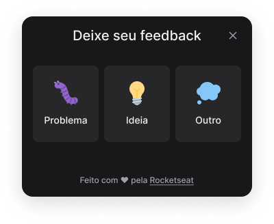

<h1 align="center">
  
</h1>

<p align="center">
 
</p>


## 💻 Projeto

Aplicação para reportar possíveis erros, sugestões ou algum outro tipo de feedback para o site ou app mobile. Com funcionalidade de envio de e-mail do feedback com o tipo, comentário e screenshot da tela.

## ✨ Tecnologias

- [Vite](https://vitejs.dev/)
- [React](https://reactjs.org)
- [TypeScript](https://www.typescriptlang.org/)
- [Tailwind CSS](https://tailwindcss.com/)

## 🔖 Layout

Você pode visualizar o layout do projeto através [desse link](https://www.figma.com/community/file/1102912516166573468/Feedback-Widget). É necessário ter conta no [Figma](http://figma.com/) para acessá-lo.

## 🚀 Como executar

Clone o projeto e acesse a pasta do mesmo.

```bash
$ git clone https://github.com/ViniciusBussolo1/nlw-06-reactjs.git
$ cd nlw-06-reactjs
```

Para iniciá-lo, siga os passos abaixo:

```bash
# Instalar as dependências
$ yarn
# Iniciar o projeto
$ yarn start
```

O app estará disponível no seu browser pelo endereço http://localhost:3000.
